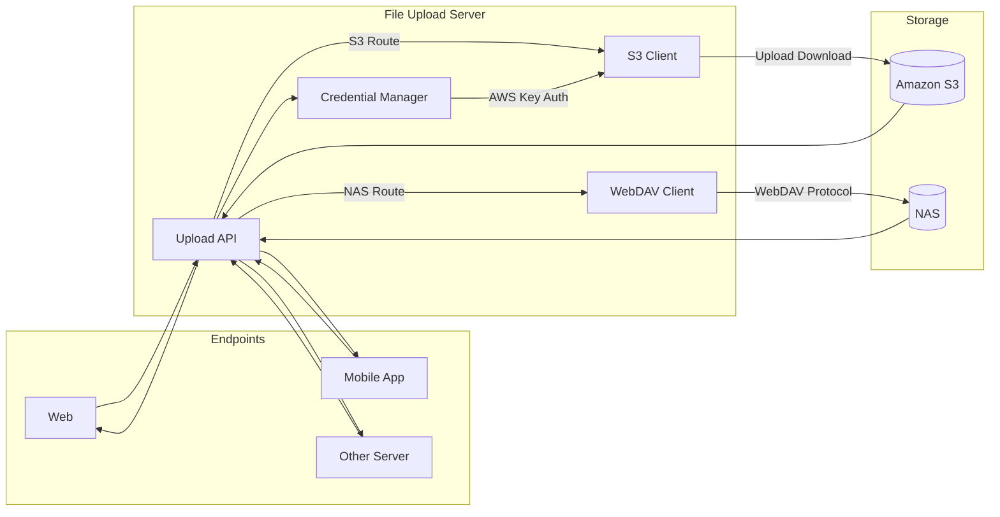

# File Upload Server 문서

---

## 목차

1. [아키텍처 개요](#1-아키텍처-개요)
2. [환경 설정](#2-환경-설정)
3. [파일명 처리 규칙](#3-파일명-처리-규칙)
4. [CORS 설정](#4-cors-설정)
5. [ETag 및 동시성 제어](#5-etag-및-동시성-제어)
6. [WebDAV API](#6-webdav-api)
7. [S3 API](#7-s3-api)
8. [Docker 배포](#8-docker-배포)
9. [대용량 파일 최적화](#9-대용량-파일-최적화-블랙박스-영상-등)
10. [데이터베이스](#10-데이터베이스)

---

## 1. 아키텍처 개요



- **파일 업로드 서버**가 클라이언트 요청을 받아 S3 또는 NAS(WebDAV)로 라우팅
- multer `diskStorage`를 사용하여 파일을 디스크에 임시 저장 후 저장소로 전송 (메모리 최적화)
- 100MB 이상 파일은 10MB 청크로 분할하여 병렬 업로드 (대용량 파일 최적화)
- WebDAV 루트 경로는 환경변수 `WEBDAV_ROOT_PATH`로 관리 (개발: `kikii_test`, 운영: `www`)
- 파일 메타데이터와 변경 히스토리는 MySQL에 기록
- 다운로드는 Range 요청 지원으로 이어받기 가능

---

## 2. 환경 설정

### 환경별 구성

| 환경 | NODE_ENV | .env 파일 | 포트 | WebDAV 루트 |
|------|----------|-----------|------|-------------|
| 로컬 개발 | `development` | `.env.development` | 8000 | `/kikii_test` |
| 온프레미스 | `onprem` | `.env.onprem` | 8989 | `/kikii_test` |
| 운영 | `production` | `.env.production` | 80 | `/www` |

### 실행 명령

```bash
# 로컬 개발 (hot reload)
npm run dev

# 온프레미스
npm run dev:onprem

# 운영
npm run start
```

### 필수 환경변수

| 변수 | 설명 |
|------|------|
| `PORT` | 서버 포트 |
| `NODE_ENV` | 실행 환경 |
| `WEBDAV_URL` | WebDAV 서버 URL |
| `WEBDAV_USER` | WebDAV 사용자명 |
| `WEBDAV_PASSWORD` | WebDAV 비밀번호 |
| `WEBDAV_ROOT_PATH` | WebDAV 저장 루트 경로 |
| `AWS_IAM_USER_KEY` | AWS IAM 액세스 키 |
| `AWS_IAM_USER_SECRET` | AWS IAM 시크릿 키 |
| `AWS_REGION` | AWS 리전 (기본: `ap-northeast-2`) |
| `CORS_ORIGINS` | 허용 도메인 (쉼표 구분) |
| `CORS_CREDENTIALS` | 쿠키 포함 허용 여부 (`true`/`false`) |
| `DB_HOST` | MySQL 호스트 |
| `DB_PORT` | MySQL 포트 |
| `DB_USER` | MySQL 사용자 |
| `DB_PASSWORD` | MySQL 비밀번호 |
| `DB_NAME` | MySQL 데이터베이스명 |

> `.env.example`을 복사하여 환경별 파일을 생성하고 실제 값을 채운다. `.env.*` 파일은 `.gitignore`에 포함되어 커밋되지 않는다.

---

## 3. 파일명 처리 규칙

파일명은 아래 단계를 거쳐 정규화된 후 저장된다.

### 3.1 한글 파일명 디코딩

multer는 파일명을 `latin1`로 디코딩하므로 한글이 깨진다. 서버 측에서 `latin1 → utf8`로 재변환한다.

```
원본 파일명: 테스트파일.png
multer 전달: ×테스트×파일.png  (latin1 해석)
디코딩 후:   테스트파일.png    (utf8로 복원)
```

### 3.2 공백 → 밑줄

파일명 내 공백은 밑줄(`_`)로 치환된다.

```
사진 파일 1.png  →  사진_파일_1.png
```

### 3.3 확장자 자동 추가

`filename` 필드에 확장자가 없으면 원본 파일의 확장자를 자동으로 추가한다.

```
filename: "보고서"        →  보고서.pdf   (원본: 보고서.pdf)
filename: "보고서.pdf"    →  보고서.pdf   (변경 없음)
```

다중 파일 업로드에서 `filenames`를 전달하지 않으면 각 파일의 원본 파일명을 그대로 사용한다.

### 3.4 중복 파일명 처리

동일 디렉토리에 같은 파일명이 존재하면 `파일명(N)` 형태로 자동 변경된다.

```
report.pdf        →  report.pdf       (중복 없음)
report.pdf (재업로드) →  report(1).pdf
report.pdf (3차)  →  report(2).pdf
```

---

## 4. CORS 설정

### 환경별 origin 정책

| 환경 | origin |
|------|--------|
| `development` | 모든 origin 허용 (`true`) |
| `onprem` | `CORS_ORIGINS` 환경변수의 도메인 목록만 허용 |
| `production` | `CORS_ORIGINS` 환경변수의 도메인 목록만 허용 |

### 공통 설정

- **Credentials**: `true` (쿠키, Authorization 헤더 포함)
- **Methods**: `GET`, `POST`, `PUT`, `DELETE`, `PATCH`, `OPTIONS`
- **Allowed Headers**: `Content-Type`, `Authorization`, `X-Requested-With`, `Accept`, `Origin`, `If-Match`, `If-None-Match`, `Cache-Control`
- **Exposed Headers**: `Content-Length`, `Content-Type`, `ETag`, `Last-Modified`
- **Preflight 캐시**: 24시간 (`maxAge: 86400`)

### 환경별 CORS_ORIGINS 예시

```
# 개발
CORS_ORIGINS=http://localhost:3000,http://localhost:3003

# 온프레미스
CORS_ORIGINS=http://kikii.iptime.org:3012,http://kikii.iptime.org:3013

# 운영
CORS_ORIGINS=https://kiki-bus.com,https://m.kiki-bus.com
```

---

## 5. ETag 및 동시성 제어

파일 업데이트(`PUT /webdav/file/{path}`)에서 ETag 기반 동시성 제어를 사용한다.

### 플로우

```
1. 클라이언트 → GET /webdav/download/{path}
   ← 응답 헤더에 ETag 포함

2. 클라이언트 → PUT /webdav/file/{path}
   → If-Match: <ETag 값>  (헤더로 전달)

3. 서버 판단:
   - If-Match 없음        → 428 (현재 ETag 반환)
   - ETag 불일치          → 412 (다른 곳에서 수정됨)
   - 파일 내용 동일        → 200 (changed: false)
   - 파일 타입 불일치      → 409 (삭제 후 새로 업로드 필요)
   - 정상 업데이트         → 200 (새 ETag 반환)
```

### ETag lazy 생성

기존 파일에 ETag가 없는 경우(업로드 이전 파일 등) 다운로드 또는 업데이트 요청 시 자동으로 생성된다.

---

## 6. WebDAV API

**Base Path**: `/webdav`

모든 경로는 환경변수 `WEBDAV_ROOT_PATH` 이후의 경로를 기준으로 한다. 클라이언트에서 루트 경로(`/www`, `/kikii_test`)를 직접 포함시키면 안 된다.

---

### 6.1 서버 정보 조회

```
GET /webdav/info
```

**Response 200**
```json
{
  "message": "WebDAV 서버 정보 조회 성공",
  "status": 200,
  "baseUrl": "http://211.233.58.24:8800",
  "timestamp": "2026-01-28T07:00:00.000Z"
}
```

---

### 6.2 단일 파일 업로드

```
POST /webdav/upload
Content-Type: multipart/form-data
```

| Field | Type | Required | Description |
|-------|------|----------|-------------|
| `file` | binary | Y | 업로드할 파일 |
| `path` | string | Y | 저장 경로 (예: `accident/test/2026-01-28/image`) |
| `filename` | string | N | 저장 파일명 (미입력 시 원본 파일명 사용, 확장자 자동 추가) |
| `domain_type` | string | N | 도메인 타입 (메타데이터 기록용) |
| `domain_id` | integer | N | 도메인 ID (메타데이터 기록용) |
| `userId` | string | N | 사용자 ID (히스토리 기록용) |

**Response 200**
```json
{
  "message": "WebDAV 파일 업로드 성공",
  "status": 200,
  "path": "http://211.233.58.24:8800/www/accident/test/파일.jpg",
  "filename": "파일.jpg",
  "size": 12345,
  "url": "http://211.233.58.24:8800/www/accident/test/파일.jpg",
  "etag": "abc123def456",
  "metadataId": 42
}
```

응답 헤더에 `ETag`가 포함된다.

---

### 6.3 다중 파일 업로드

```
POST /webdav/upload-multiple
Content-Type: multipart/form-data
```

최대 **10개** 파일. 동시성 제한 3개씩 병렬 처리.

| Field | Type | Required | Description |
|-------|------|----------|-------------|
| `files` | binary[] | Y | 업로드할 파일 목록 |
| `path` | string | Y | 저장 경로 |
| `filenames` | string[] | N | 각 파일의 저장 파일명 (미입력 시 원본 파일명 사용) |

`filenames`를 전달할 경우 `files`와 개수가 동일해야 한다. 각 파일명의 확장자가 실제 파일과 다르면 해당 파일은 실패 처리된다.

**Response 200**
```json
{
  "message": "다중 파일 업로드 완료: 2개 성공, 0개 실패",
  "status": 200,
  "path": "accident/test/2026-01-28",
  "results": [
    {
      "filename": "a.png",
      "originalFilename": "a.png",
      "success": true,
      "size": 1111,
      "url": "http://211.233.58.24:8800/www/accident/test/2026-01-28/a.png",
      "msg": "신규 생성 완료",
      "renamed": false
    },
    {
      "filename": "b(1).png",
      "originalFilename": "b.png",
      "success": true,
      "size": 2222,
      "url": "http://211.233.58.24:8800/www/accident/test/2026-01-28/b(1).png",
      "msg": "중복으로 이름 변경: b.png → b(1).png",
      "renamed": true
    }
  ],
  "summary": {
    "total": 2,
    "success": 2,
    "failed": 0
  }
}
```

---

### 6.4 파일 다운로드

```
GET /webdav/download/{path}
```

| Parameter | Location | Required | Description |
|-----------|----------|----------|-------------|
| `path` | path | Y | 파일 경로 (예: `accident/test/image/파일.jpg`) |
| `disposition` | query | N | `inline`(기본, 브라우저 표시) / `attachment`(파일 다운로드) |

파일 바이너리를 직접 반환한다. 응답 헤더에 `ETag`, `Content-Type`, `Content-Disposition` 포함.

---

### 6.5 디렉토리 생성

```
POST /webdav/directory
Content-Type: application/json
```

```json
{
  "path": "accident/test/2026-01-28/image"
}
```

중간 경로가 없으면 자동으로 생성된다 (`ensureDirectory`).

**Response 200**
```json
{
  "message": "WebDAV 디렉토리 생성 성공",
  "status": 200,
  "path": "accident/test/2026-01-28/image"
}
```

---

### 6.6 디렉토리 존재 여부 확인

```
GET /webdav/directory/{path}
```

| Parameter | Location | Required | Description |
|-----------|----------|----------|-------------|
| `path` | path | Y | 조회할 디렉토리 경로 |

**Response 200**
```json
{
  "message": "WebDAV 디렉토리 조회 성공",
  "status": 200,
  "path": "accident/test/2026-01-28",
  "directory": true
}
```

`directory` 값은 존재하면 `true`, 아니면 `false`.

---

### 6.7 파일 업데이트 (덮어쓰기)

```
PUT /webdav/file/{path}
Content-Type: multipart/form-data
If-Match: <ETag>
```

| Field | Location | Required | Description |
|-------|----------|----------|-------------|
| `path` | path | Y | 업데이트할 파일 경로 (확장자 없이도 자동 탐색) |
| `If-Match` | header | Y | 현재 ETag 값 (없으면 428 응답) |
| `file` | body | Y | 새 파일 |
| `userId` | body | Y | 사용자 ID (히스토리 기록용) |

**Response 200**
```json
{
  "message": "파일 업데이트 성공",
  "status": 200,
  "path": "accident/test/image/파일.jpg",
  "filename": "파일.jpg",
  "size": 15000,
  "url": "http://211.233.58.24:8800/www/accident/test/image/파일.jpg",
  "etag": "newEtagValue",
  "changed": true
}
```

| 상태 코드 | 의미 |
|-----------|------|
| 200 | 업데이트 성공 (`changed: true`) 또는 파일 동일 (`changed: false`) |
| 400 | 필수 파라미터 누락 |
| 404 | 파일 존재하지 않음 |
| 409 | 파일 타입(MIME) 불일치 |
| 412 | ETag 불일치 (다른 곳에서 수정됨) |
| 428 | If-Match 헤더 누락 (현재 ETag를 응답 본문과 헤더로 반환) |

---

### 6.8 파일 삭제

```
DELETE /webdav/file/{path}?userId={userId}
```

| Parameter | Location | Required | Description |
|-----------|----------|----------|-------------|
| `path` | path | Y | 삭제할 파일 경로 |
| `userId` | query | N | 사용자 ID (히스토리 기록용) |

파일은 실제로 삭제되고, DB에서 `file_metadata` 상태는 `DELETED`로 논리 삭제된다.

**Response 200**
```json
{
  "message": "파일 삭제 성공",
  "status": 200,
  "path": "accident/test/image/파일.jpg"
}
```

---

### 6.9 디렉토리 삭제

```
DELETE /webdav/directory/{path}?force={true|false}
```

| Parameter | Location | Required | Default | Description |
|-----------|----------|----------|---------|-------------|
| `path` | path | Y | - | 삭제할 디렉토리 경로 |
| `force` | query | N | `false` | `true`이면 내부 파일이 있어도 강제 삭제 |

`force=false`이고 디렉토리 내 파일이 있으면 409 응답과 함께 내부 파일 목록을 반환한다.

---

### 6.10 파일/디렉토리 이동

```
PUT /webdav/move
Content-Type: application/json
```

```json
{
  "sourcePath": "accident/test/image/old_name.jpg",
  "destPath": "accident/test/image/new_name.jpg",
  "overwrite": true
}
```

파일 이름 변경에도 사용 가능하다. `overwrite`는 기본값 `true`.

**Response 200**
```json
{
  "message": "이동 성공",
  "status": 200,
  "sourcePath": "accident/test/image/old_name.jpg",
  "destPath": "accident/test/image/new_name.jpg"
}
```

---

### 6.11 파일/디렉토리 복사

```
PUT /webdav/copy
Content-Type: application/json
```

```json
{
  "sourcePath": "accident/test/image/original.jpg",
  "destPath": "accident/backup/image/copy.jpg",
  "overwrite": true
}
```

구조와 응답은 이동과 동일하다.

---

### 6.12 파일 시스템 통계 조회

```
GET /webdav/stats
```

**Response 200**
```json
{
  "message": "통계 조회 성공",
  "status": 200,
  "summary": {
    "totalFiles": 150,
    "activeFiles": 130,
    "deletedFiles": 15,
    "desyncFiles": 3,
    "missingFiles": 2
  },
  "stats": {
    "UPLOAD": 100,
    "UPDATE": 50,
    "DELETE": 10
  },
  "byUser": {
    "user1": 80,
    "system": 30
  },
  "daily": [
    { "date": "2026-02-04", "action": "UPLOAD", "count": 5 },
    { "date": "2026-02-03", "action": "UPDATE", "count": 2 }
  ]
}
```

- `summary`: 파일 상태별 요약 (ACTIVE, DELETED, DESYNC, MISSING)
- `stats`: 액션별 히스토리 누적 카운트
- `byUser`: 사용자별 액션 수 (상위 10명)
- `daily`: 최근 7일 일별 통계

---

## 7. S3 API

**Base Path**: `/s3`

---

### 7.1 단일 파일 업로드

```
POST /s3/upload
Content-Type: multipart/form-data
```

| Field | Type | Required | Description |
|-------|------|----------|-------------|
| `file` | binary | Y | 업로드할 파일 |
| `bucketName` | string | Y | S3 버킷 이름 |

**Response 200**
```json
{
  "message": "파일 업로드 성공",
  "status": 200,
  "object": {
    "bucket": "my-s3-bucket",
    "key": "sample.png",
    "url": "https://my-s3-bucket.s3.amazonaws.com/sample.png",
    "size": 12345
  }
}
```

---

### 7.2 다중 파일 업로드

```
POST /s3/upload/multiple
Content-Type: multipart/form-data
```

최대 **10개** 파일.

| Field | Type | Required | Description |
|-------|------|----------|-------------|
| `files` | binary[] | Y | 업로드할 파일 목록 (최대 10개) |
| `bucketName` | string | Y | S3 버킷 이름 |
| `path` | string | Y | 버킷 내 저장 경로 |

**Response 200**
```json
{
  "message": "파일 업로드 성공",
  "status": 200,
  "object": [
    {
      "bucket": "my-s3-bucket",
      "key": "uploads/2026/01/a.png",
      "url": "https://my-s3-bucket.s3.amazonaws.com/uploads/2026/01/a.png",
      "size": 1111
    },
    {
      "bucket": "my-s3-bucket",
      "key": "uploads/2026/01/b.png",
      "url": "https://my-s3-bucket.s3.amazonaws.com/uploads/2026/01/b.png",
      "size": 2222
    }
  ]
}
```

---

## 8. Docker 배포

### 빌드 스크립트

```bash
# 개발
./scripts/build-dev.sh

# 온프레미스
./scripts/build-onprem.sh

# 운영
./scripts/build-prod.sh
```

### 실행

```bash
# 개발
docker run -d -p 8000:8000 --env-file .env.development --name file-server-dev file-server:dev

# 온프레미스
docker run -d -p 8989:8989 --env-file .env.onprem --name file-server-onprem file-server:onprem

# 운영
docker run -d -p 80:80 --env-file .env.production --name file-server-prod file-server:prod
```

### Dockerfile 구성

| 파일 | 환경 | EXPOSE |
|------|------|--------|
| `Dockerfile` | production | 80 |
| `Dockerfile.dev` | development | 8000 |
| `Dockerfile.onprem` | onprem | 8989 |

---

## 9. 대용량 파일 최적화 (블랙박스 영상 등)

### 9.1 개요

500MB~3GB 대용량 파일(블랙박스 영상, 고화질 영상 등)의 안정적 처리를 위한 최적화가 적용되어 있습니다.

### 9.2 Disk Storage 방식

**이전 방식 (Memory Storage):**
- 파일 전체를 메모리(RAM)에 로드
- 500MB 파일 → RAM 500MB 사용
- 동시 업로드시 메모리 부족으로 서버 다운 위험

**현재 방식 (Disk Storage):**
- 파일을 서버 디스크(`/tmp/uploads`)에 임시 저장
- 스트림으로 읽어서 WebDAV/S3로 전송
- RAM 사용량: 파일 크기와 무관하게 10-50MB만 사용

```javascript
// src/config/multer.js
multer.diskStorage({
  destination: '/tmp/uploads',
  filename: 'timestamp-random-filename'
})
```

**효과:**
- 메모리 사용량 96% 감소 (500MB → 20MB)
- 동시 처리 능력 20배 향상 (1명 → 20명)
- 서버 안정성 확보

### 9.3 청크 분할 병렬 업로드

**100MB 이상 파일 자동 분할:**
- 10MB 청크로 분할
- 5개 청크씩 병렬 업로드
- 서버에서 자동 병합

```javascript
// src/services/web_dav/multipartUpload.js
const CHUNK_SIZE = 10 * 1024 * 1024; // 10MB
const PARALLEL_CHUNKS = 5; // 동시 5개
```

**업로드 플로우:**
```
1GB 파일 업로드
├─ 100개 청크로 분할 (10MB × 100)
├─ 5개씩 병렬 전송
│  ├─ chunk_00000 ~ chunk_00004 (동시)
│  ├─ chunk_00005 ~ chunk_00009 (동시)
│  └─ ...
└─ WebDAV 서버에서 병합 → 최종 파일
```

**효과:**
- 업로드 속도 2-3배 향상
- 네트워크 대역폭 최대 활용
- 실패시 해당 청크만 재전송 가능

### 9.4 디렉토리 캐싱

**이전 방식:**
- 업로드마다 전체 경로 순차 확인
- 예: `a/b/c/d/e` → 5번의 네트워크 요청

**현재 방식:**
- 디렉토리 존재 여부 1시간 캐싱
- 캐시 히트시 네트워크 요청 0회

```javascript
// src/services/web_dav/webdavClient.js
const dirCache = new Map(); // 경로 → 타임스탬프
const CACHE_TTL = 3600000; // 1시간
```

**효과:**
- 디렉토리 확인 시간 600-1200ms → 0-50ms
- API 응답 속도 향상

### 9.5 HTTP Keep-Alive 및 연결 재사용

**WebDAV 클라이언트 최적화:**

```javascript
const httpsAgent = new https.Agent({
  keepAlive: true,
  keepAliveMsecs: 30000,
  maxSockets: 10, // 동시 연결 수
  maxFreeSockets: 5
});
```

**효과:**
- TCP 핸드셰이크 오버헤드 제거
- 각 요청 50-100ms 단축

### 9.6 Range 요청 지원 (이어받기)

다운로드시 Range 헤더를 지원하여 중단된 다운로드를 이어받을 수 있습니다.

```http
GET /webdav/download/video.mp4
Range: bytes=524288000-

→ 206 Partial Content
Content-Range: bytes 524288000-1048576000/1048576000
```

**효과:**
- 대용량 파일 다운로드 중단시 처음부터 다시 받을 필요 없음
- 모바일 환경에서 네트워크 끊김 대응

### 9.7 성능 비교

**1GB 블랙박스 영상 기준:**

| 항목 | 이전 (Memory) | 현재 (Disk + 청크) | 개선율 |
|------|--------------|-------------------|--------|
| **업로드 시간** | 100-240초 | 30-80초 | **3배 빠름** |
| **업로드 RAM** | 1GB | 50MB | **20배 절감** |
| **다운로드 시간** | 160-400초 | 80-200초 | **2배 빠름** |
| **다운로드 TTFB** | 80-200초 | 0.1초 | **1000배 빠름** |
| **동시 처리** | 1명 | 20명 | **20배 증가** |
| **서버 안정성** | ⚠️ 위험 | ✅ 안정 | - |

**TTFB (Time To First Byte):**
- 이전: 파일 전체를 메모리에 로드한 후 전송 시작 (80-200초 대기)
- 현재: 즉시 스트리밍 시작 (0.1초)

### 9.8 임시 파일 관리

**자동 정리:**
- 오래된 임시 파일 자동 삭제 (2시간 이상)
- 1시간마다 정리 작업 실행

```javascript
// src/config/multer.js
setInterval(cleanupOldTempFiles, 3600000); // 1시간마다
```

**임시 파일 저장 위치:**
- macOS/Linux: `/tmp/file-upload-server`
- Windows: `%TEMP%\file-upload-server`

---

## 10. 데이터베이스

### file_metadata

파일 정보와 현재 상태를 저장한다.

| 컬럼 | 설명 |
|------|------|
| `id` | PK |
| `domain_type` | 도메인 타입 |
| `domain_id` | 도메인 ID |
| `file_path` | 파일 경로 (루트 경로 제외) |
| `file_name` | 파일명 |
| `extension` | 확장자 |
| `mime_type` | MIME 타입 |
| `file_size` | 파일 크기 (bytes) |
| `content_hash` | SHA-256 해시 |
| `etag` | ETag 값 |
| `status` | `ACTIVE` / `DELETED` / `DESYNC` / `MISSING` |
| `created_at` | 생성 시간 |
| `updated_at` | 수정 시간 |

### file_metadata_history

파일 변경 히스토리를 기록한다.

| 컬럼 | 설명 |
|------|------|
| `id` | PK |
| `file_metadata_id` | FK → file_metadata |
| `action` | `UPLOAD` / `UPDATE` / `DELETE` |
| `old_etag` | 변경 전 ETag |
| `new_etag` | 변경 후 ETag |
| `old_hash` | 변경 전 해시 |
| `new_hash` | 변경 후 해시 |
| `changed_by` | 변경 사용자 (userId 또는 `system`) |
| `created_at` | 기록 시간 |
