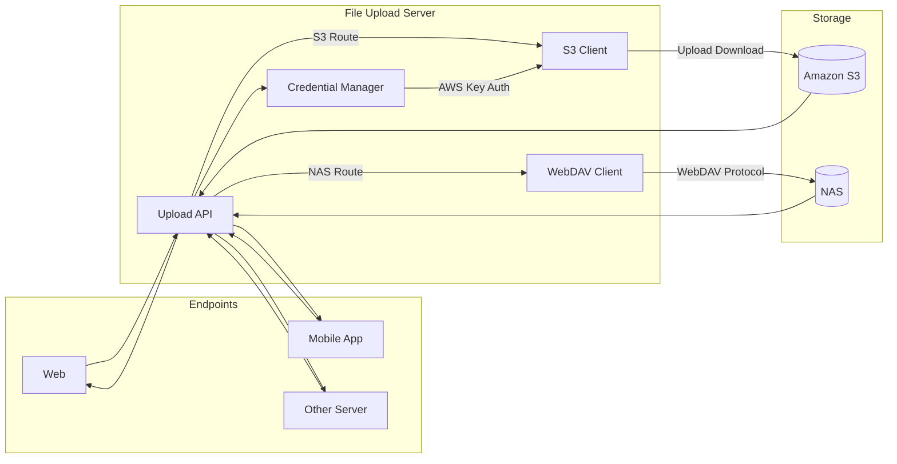

# 1. 기본 아키텍처



</br>
</br>
</br>

# 2. API 문서
## WebDAV API Specification

### Base Information
- Base Path: `/webdav`
- Supported Content Types
  - `application/json`
  - `multipart/form-data`
- File Upload Handling
  - `multer.memoryStorage()` 사용
  - 업로드 파일은 메모리에 적재 후 WebDAV 서버로 전송
- Path Parameter
  - `:path(*)` 사용 → `/` 포함 경로 허용

---

## 1. WebDAV 서버 정보 조회

### GET `/webdav/info`

WebDAV 서버의 기본 정보를 조회합니다.

#### Request
- Parameters: 없음
- Body: 없음

#### Response

**200 OK**
```json
{
  "message": "서버 정보 조회 성공",
  "status": 200,
  "baseUrl": "https://webdav.example.com",
  "timestamp": "2026-01-08T12:34:56.000Z"
}
```

## 2. WebDAV 단일 파일 업로드

### `POST /webdav/upload`

파일을 WebDAV 서버에 업로드합니다.

---

### Request

- **Content-Type**: `multipart/form-data`

#### Form Data

| Field | Type | Required | Description |
|---|---|---:|---|
| `file` | `binary` | ✅ | 업로드할 파일 |
| `filename` | `string` | ❌ | 저장할 파일명(미전달 시 서버/컨트롤러 정책에 따름) |
| `path` | `string` | ✅ | WebDAV 서버의 업로드 대상 경로 |

#### Response 

**200 OK**


```json
  {
  "success": "true",
  "filename": "sample.png",
  "size": 12345,
  "url": "https://webdav.example.com/uploads/2026/01/sample.png"
}
```


## 3. WebDAV 다중 파일 업로드

### `POST /webdav/upload-multiple`

여러 파일을 WebDAV 서버에 동시에 업로드합니다.  
최대 **10개 파일**까지 업로드할 수 있습니다.

---

### Request

- **Content-Type**: `multipart/form-data`

#### Form Data

| Field | Type | Required | Description |
|---|---|---:|---|
| `files` | `binary[]` | ✅ | 업로드할 파일 목록 |
| `filenames` | `string[]` | ✅ | 각 파일의 저장 파일명 |
| `path` | `string` | ✅ | WebDAV 서버의 업로드 대상 경로 |

> `files`와 `filenames`는 **순서와 개수가 반드시 일치**해야 합니다.

#### Response 
**200 OK**


```json
  {
  "success": "true",
  "filename": "sample.png",
  "size": 12345,
  "url": "https://webdav.example.com/uploads/2026/01/sample.png"
}
```

## 4. WebDAV 파일 다운로드

### `GET /webdav/download/{path}`

WebDAV 서버에 저장된 파일을 다운로드하거나 브라우저에서 바로 표시합니다.

---

### Request

#### Path Parameters

| Name | Type | Required | Description |
|---|---|---:|---|
| `path` | `string` | ✅ | 다운로드할 파일의 전체 경로 (`/` 포함 가능) |

#### Query Parameters

| Name | Type | Required | Default | Description |
|---|---|---:|---|---|
| `disposition` | `string` | ❌ | `inline` | `inline`(브라우저 표시) / `attachment`(다운로드) |


### Response

**200 OK**

```json
{
  "message": "파일 다운로드 성공",
  "status": 200,
  "path": "/uploads/2026/01/a.png",
  "file": {
    "filename": "a.png",
    "contentType": "image/png",
    "size": 1111
  }
}
```

## 5. WebDAV 디렉토리 생성

### `POST /webdav/directory`

WebDAV 서버에 새로운 디렉토리를 생성합니다.

---

### Request

- **Content-Type**: `application/json`

#### Body

```json
{
  "path": "/uploads/2026/01/new-folder"
}
```