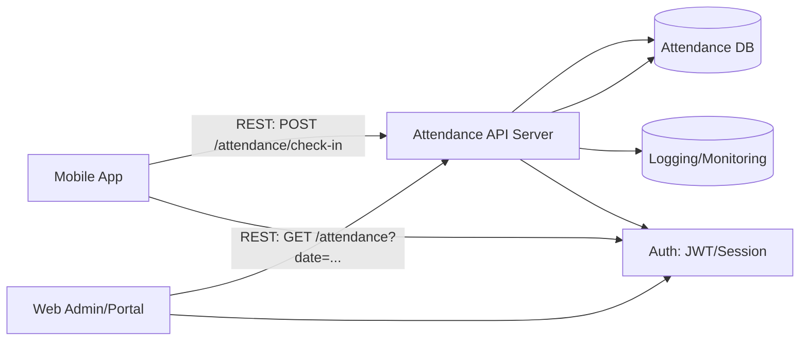

# S3 File Upload Server

파일 업로드 서버입니다.

## 환경 설정

`.env` 파일에 다음 환경 변수를 설정해주세요:

```env
AWS_IAM_USER_KEY=your_access_key_id
AWS_IAM_USER_SECRET=your_secret_access_key
AWS_REGION=ap-northeast-2
```

## 버킷명

1. kikiannualrequest: 연차 관련 증빙자료 버킷
2. kikibusdamage: 운행전점검시 차량 파손 자료 버킷
3. kikinotice: 공지사항 첨부자료 버킷

4. startts-employees: 직원 증빙서류 업로드용 버킷(위의 세 버킷은 사용하다 deprecate 예정).
  path rule: {driver_id}/{document_type}      // 맨앞 슬래시 X
  - document_type
    leave_early: 중도귀가
    absent: 결근
    paid_annual: 유급

## API 문서

### 1. 단일 파일 업로드

**엔드포인트:** `POST s3/upload`

**Content-Type:** `multipart/form-data`

**요청 예시:**
```json
{
  "headers": {
    "Content-Type": "multipart/form-data"
  },
  "body": {
    "bucketName": string,
    "path": string,
    "file": file
  }
}
```

**응답 예시:**
```json
{
    "message": string,
    "object": {
        "success": true,
        "fileName": "20240315_123456_example.jpg",
        "size": 12345,
        "url": "https://..."
    },
    "status": 200
}
```

### 2. 다중 파일 업로드

**엔드포인트:** `POST s3/upload/multiple`

**Content-Type:** `multipart/form-data`

**요청 예시:**
```json
{
  "headers": {
    "Content-Type": "multipart/form-data"
  },
  "body": {
    "bucketName": string,
    "path": string    // "/kikii/test/1234 ...",
    "files": file1,
    "files": file2,
    ...,
    "files": file10
  }
}
```

**응답 예시:**
```json
{
    "message": string,
    "object": {
        [
            {
                "success": true,
                "fileName": "20240315_123456_example.jpg",
                "size": 12345,
                "url": "https://..."
            }, ...
        ]
    },
    "status": 200
}
```

## 에러 응답

### 파일 없음
```json
{
  "message": "파일이 없습니다."
}
```

### 파일 개수 초과 (다중 업로드)
```json
{
  "message": "파일 개수가 10개를 초과했습니다."
}
```

### 업로드 실패
```json
{
  "message": "파일 업로드 중 오류가 발생했습니다."
}
```

## Docker 실행 방법

### 로컬에서 실행

1. 이미지 빌드:
```bash
docker build -t s3-upload-server .
```

2. 컨테이너 실행:
```bash
docker run -p 8989:8989 --env-file .env s3-upload-server
```

### Docker Hub 배포

1. Docker Hub 로그인:
```bash
docker login
```

2. 이미지 태그 설정:
```bash
docker tag s3-upload-server [DOCKER_HUB_USERNAME]/s3-upload-server:latest
```

3. Docker Hub에 푸시:
```bash
docker push [DOCKER_HUB_USERNAME]/s3-upload-server:latest
```

4. 배포된 이미지 실행:
```bash
docker run -p 8989:8989 --env-file .env [DOCKER_HUB_USERNAME]/s3-upload-server:latest
```

## 로컬 실행 방법

1. 의존성 설치:
```bash
npm install
```

2. 서버 실행:
```bash
npm run dev
```

## 제한사항

- 단일 파일 업로드: 파일 1개
- 다중 파일 업로드: 최대 10개 파일
- 파일 크기 제한: 5MB (multer 설정) 

